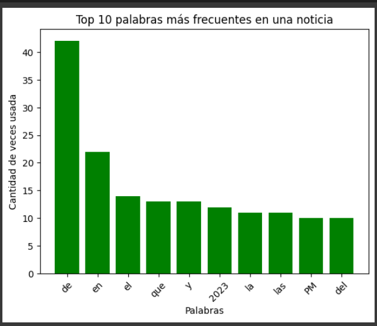

# Tarea-Analisis-Linguistico

# Análisis Lingüístico en Python

Este repositorio contiene un proyecto que realiza un análisis lingüístico de una página web en español utilizando Python. A continuación, se describen los aspectos clave de este proyecto.

## Licencia

Este proyecto está bajo la licencia MIT. Consulta el archivo LICENSE.md para obtener más detalles.

## Descripción

En este proyecto, se realiza un análisis lingüístico de una página web en español utilizando Python. Las tareas principales incluyen la identificación y extracción de oraciones y tokens, el manejo de caracteres especiales y la aplicación de la teoría del tamaño del vocabulario.

## Proceso de Análisis

### Identificación de Oraciones

1. Se limpia el formato HTML de la página para facilitar la identificación de las oraciones.
2. Se utilizan expresiones regulares para identificar y extraer las oraciones claramente del texto.

### Identificación de Tokens

1. Los tokens se refieren a las palabras dentro de las oraciones.
2. Se extraen fácilmente mediante el uso de expresiones regulares.

### Caracteres Especiales

No se hace distinción entre los caracteres especiales del español.
Expresiones regulares generales se utilizan para tener en cuenta todos los caracteres.

### Expresiones Regulares Utilizadas

- Para extraer oraciones: `r'.*.'`
- Para extraer palabras de las oraciones: `r'\w+'`

### Tamaño del Vocabulario

Según la teoría, a medida que el texto se vuelve más grande, aumenta la cantidad de palabras distintas en el documento. Esto se comporta de acuerdo con la ley de Herdan.

## Análisis de Frecuencia

1. Se muestra la frecuencia de cada término en el vocabulario, ordenados de mayor a menor frecuencia.

2. Se incluye una gráfica que representa la distribución de la frecuencia de términos.

## Distribución de Zipf

La distribución de Zipf establece que las palabras más utilizadas aparecerán con mayor frecuencia que las menos utilizadas. Esto se describe de la siguiente manera: "La segunda palabra más usada aparecerá la mitad de veces que la palabra más usada, la tercera palabra más usada un tercio de veces que la más usada, la cuarta palabra más usada un cuarto de veces que la más usada, y así sucesivamente." (1)

## Resultados

A continuación, se presenta una gráfica que muestra las palabras más utilizadas en la noticia analizada. Como era de esperar, según la teoría, la palabra más utilizada suele ser una preposición.

La gráfica proporciona una representación visual de las palabras más frecuentes en el texto analizado. Esto puede ayudar a los lectores a obtener una comprensión rápida de los temas clave abordados en la noticia. Ten en cuenta que la legibilidad de la gráfica se está mejorando para facilitar la identificación de cada palabra.

Si desea explorar más detalles sobre el análisis o los resultados, puede consultar el archivo Jupyter Notebook correspondiente.

---
## Bibliografía

[(1) La ley de Zipf revisitada](https://www.madrimasd.org/blogs/matematicas/2019/03/10/146325#:~:text=La%20ley%2C%20de%20manera%20simple,m%C3%A1s%20usada%2C%20y%20as%C3%AD%20sucesivamente.)

---
## Mejoras

El proyecto de análisis lingüístico de noticias en línea es un trabajo en progreso, y existen oportunidades para mejorarlo aún más. Algunas de las mejoras que se consideran incluyen:

1. **Enfoque en la Noticia Principal**: Actualmente, el análisis abarca todas las noticias de la página web, lo que puede incluir noticias más pequeñas. Una mejora sería implementar un filtro que se centre exclusivamente en la noticia principal o más relevante del sitio web.

2. **Mejora en la Visualización de las Palabras más Utilizadas**: La gráfica que muestra las palabras más utilizadas puede no ser óptima en términos de legibilidad. Se Planea mejorar la presentación de esta gráfica para que las palabras sean más claramente identificables.

Estas mejoras están en la hoja de ruta para futuras actualizaciones del proyecto. Además, ten en cuenta que el archivo .ipynb puede no mostrarse correctamente en GitHub, pero siempre se puede descargar para una visualización adecuada en su entorno local. También se proporciona el código en python donde se puede ver que se hizo y el código fuente, pero sin la visualización que tiene el archivo .ipython.

Se agradece cualquier comentario o contribución de la comunidad para seguir mejorando este proyecto. Si tiene ideas adicionales o sugerencias, no dude en compartirlas.
